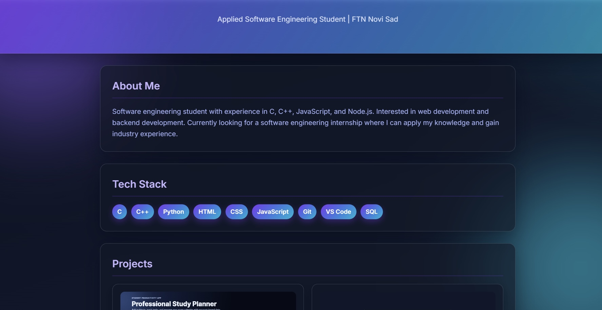

# Portfolio

A personal portfolio website for internship applications.

## Description

Personal portfolio website created to showcase my software engineering projects,
technical skills and internship readiness.

## Projects

The portfolio currently includes:

- Study Planner Web App  
   GitHub: https://github.com/KristinaDoslov/StudyPlanner.git
- ScreenTime  
   GitHub: https://github.com/KristinaDoslov/ScreenTime.git

Note: project cards currently include GitHub links only (no Live Demo links).

## Technologies

- HTML
- CSS
- JavaScript

## Screenshot



## Contents

- Hero section
- About me
- Tech stack
- Projects

## Project Images

- `studyplanner-screenshot.jpg`
- `ScreenTimeApplicationPicture.jpg`

## Run Locally

Since this is a static website, you can open `index.html` directly in your browser.

Optional local server:

```bash
py -3 -m http.server 8080 --directory Portfolio
```

Then open: http://localhost:8080/

## Git Commands (Push to GitHub)

If you are in the repository folder (Portfolio/Portfolio), run:

```bash
git add .
git commit -m "Add internship portfolio website"
git push origin main
```

If your branch is master, use:

```bash
git push origin master
```

## Suggested Deployment (GitHub Pages)

1. Open your repository on GitHub.
2. Go to Settings > Pages.
3. Under Build and deployment, choose:
   - Source: Deploy from a branch
   - Branch: main (or master), folder /root
4. Save and wait a few minutes.
5. Your site URL will appear in the GitHub Pages section.
